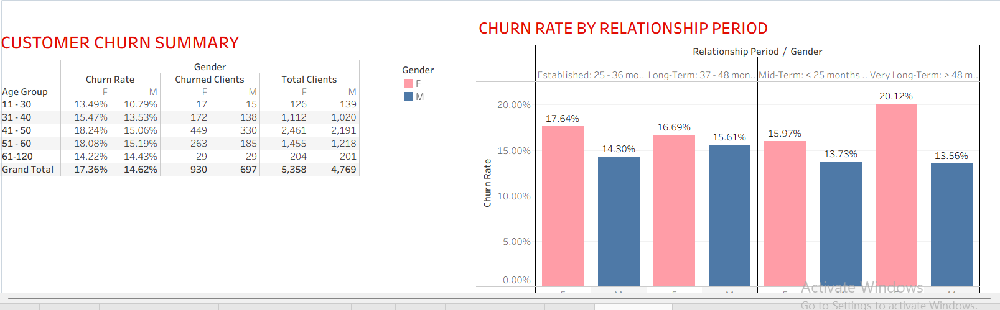
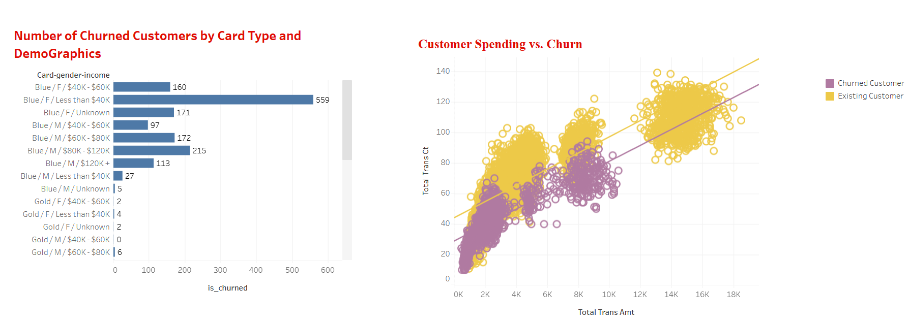
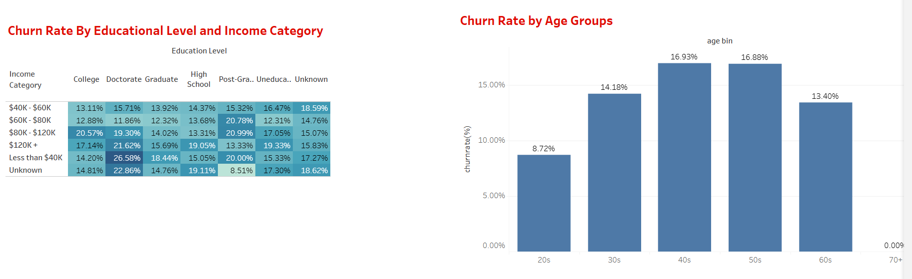
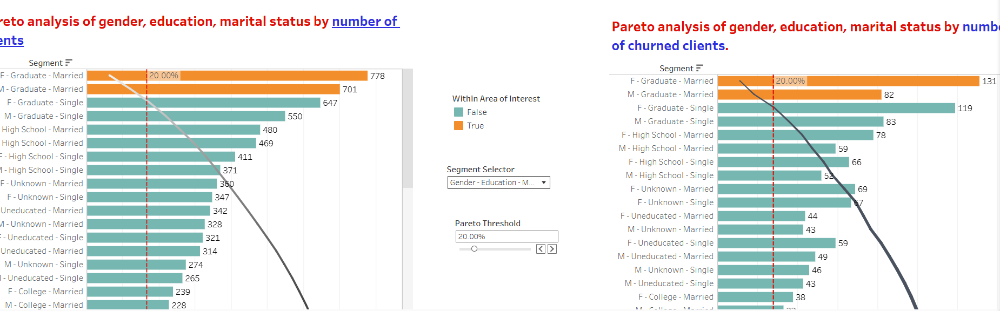

# Dollar Bank — Customer Churn Analysis (SQL • Python • Tableau)

## Introduction
Dollar Bank asked for an analysis to understand why customers were leaving its credit card product and how losses can be reduced. This project joins three datasets, performs EDA and feature engineering in Python, and implements a polished, interactive Tableau dashboard that surfaces the key churn drivers and highest-impact customer segments.

**Project summary :**

**End-to-end analysis combining SQL, Python, and Tableau to identify which customers are leaving Dollar Bank's credit-card product, why they leave, and which interventions will most cost-effectively reduce churn.**

---

## Problem statement 

Dollar Bank noticed an increasing number of customers leaving their credit card program. The business question for this project:

> **Which customer segments are churning, what behaviors and attributes are associated with churn, and where should the bank focus retention efforts to get the largest impact?**

---

## What I delivered
- A reproducible data pipeline (CSV → cleaned dataset) and exploratory analysis in **Python**.  
- A set of analytical SQL queries used to validate joins, counts, and aggregated metrics.  
- A production-style **Tableau dashboard** that contains KPI cards, demographic heatmaps, churn-by-tenure visualizations, spending-vs-churn scatter plots, and Pareto charts that identify the “vital few” segments to focus on.

---

## Data sources
Files are included under `data/`:
- `bankchurners.csv` — account and churn flag metadata (attrition flag, months_on_book, card_category, credit_limit, contact_count).  
- `basic_client_info.csv` — demographic attributes (gender, education_level, income_category, marital_status, customer_age).  
- `enriched_churn_data.csv` — transaction aggregates (total_transaction_amount, total_transaction_count, Q4→Q1 change features, etc.).

Primary key: `clientnum`. Churn flag used in calculations: rows with `Attrition Flag = 'Attrited Customer'` are treated as churned.

---

## Methodology
1. **Data validation & join (SQL)** — checked row counts, uniqueness of `clientnum`, validated joins, ensured no unintentional duplicates.  
2. **Python EDA** — cleaned missing values, created age bins and months-on-book buckets, computed client-level aggregates (ensuring one row per client for the dashboard), explored distributions, and verified potential predictors of churn (spend, transactions, tenure, demographics).  
3. **Tableau dashboard** — created KPIs, heatmap (education × income churn), churn-by-tenure (months on book) grouped by gender, scatterplot (Total Transaction Amount vs Total Transaction Count colored by churn), and Pareto analyses for prioritization.
4. **Interpretation & recommendations** — translated findings into prioritized actions with expected ROI.

---

## How this solves the business problem
- It identifies the **highest-impact segments** (vital few) so retention resources can be focused.  
- It surfaces **behavioral signals** (low total spend and low transaction count) that are actionable — e.g., targeted rewards to increase activity.  
- It clarifies **tenure risk** windows (25–48 months) where targeted outreach can be most effective.

---

## Dashboard & visuals

### KPI overview  
High-level snapshot of the business health: total customers, average customer age, average transaction amounts, average transaction amount for churned customers, and overall churn rate.

**Why this matters:** These KPIs let leadership quickly judge the problem scale (16% churn) and coarse behavioral differences (churners have lower average spend).

---

### Customer churn summary & relationship period  
This section provides a table summary (age bins × gender) and a grouped bar chart of churn rate by tenure buckets (Mid-Term / Established / Long-Term / Very-Long-Term), split by gender.

**What to look for:** churn concentration by age/gender and whether churn peaks in a particular tenure window (helpful for retention nudges timed to lifecycle).

---

### Churn by card type & spending behavior  
Contains counts of churned customers by card type and demographic segments plus a scatterplot of **Total Transaction Amount ($)** vs **Total Transaction Count**, colored by churn status.

**Key insight:** churned customers cluster at **lower total spend and lower transaction counts** — an actionable signal to design transaction-based incentives.

---

### Churn by education & age  
A heatmap shows churn rate by **Education Level (rows)** × **Income Category (columns)**; adjacent is churn rate by age group.

**Business value:** identifies demographic intersections (education × income) with elevated churn rates — valuable for targeted campaigns or product design testing.

---

### Pareto analysis: segments & churn concentration  
Pareto charts show which combinational segments (Gender + Education + Marital Status) represent the majority of customers and which account for most churn.

**Why Pareto helps:** it reveals the “vital few” segments responsible for a large share of churn — focusing on these segments yields the greatest ROI for retention spend.

---

## Key findings (concise & prioritized)
1. **Overall churn ~ 16%** (meaningful loss; one in six customers leaving).  
2. **Lower spenders and low-activity customers churn more** — churners average ≈ $3,095 total spend vs ≈ $4,404 overall. Many churners performed fewer than 100 transactions.  
3. **Tenure risk window** — customers in the Established (25–36 months) and Long-Term (37–48 months) buckets show elevated churn. Consider lifecycle outreach at 18–36 months.  
4. **Demographic hotspots** — female customers ages 41–50 and certain education×income combinations show higher churn rates.  
5. **Pareto segments (vital few)** — a small number of segments (female graduates — married & single; male graduates single) generate a disproportionate share of churn.

---

## Recommendations (actionable, prioritized)
**Tier 1 (highest ROI):**
- Run targeted retention offers for the Pareto segments (female graduates; male graduate single). Use personalized reward incentives.  
- Launch transaction-incentive pilots (e.g., reward points for repeat transactions) targeted to low-activity customers.

**Tier 2:**
- Lifecycle outreach for customers nearing 24–36 months on book (special retention offers or check-in calls).  
- Product or service audits for lower-income graduate segments that show high churn (offers/repricing).

**Tier 3 (test & learn):**
- A/B test different incentives (cashback vs points vs fee waiver) and measure retention lift on pilot cohorts.

---

## How to run / reproduce
1. Place CSVs in `data/` (already done): `bankchurners.csv`, `basic_client_info.csv`, `enriched_churn_data.csv`.  
2. Open `notebooks/customer_churn.ipynb` and run the cells — this notebook contains cleaning steps and summary queries.  
3. Open Tableau, connect to the joined dataset (or the `enriched_churn_data.csv` if it has client-level aggregates), and open the dashboard workbook. The README screenshots are taken from that dashboard.

---

## Files & structure (what to include in the repo)
